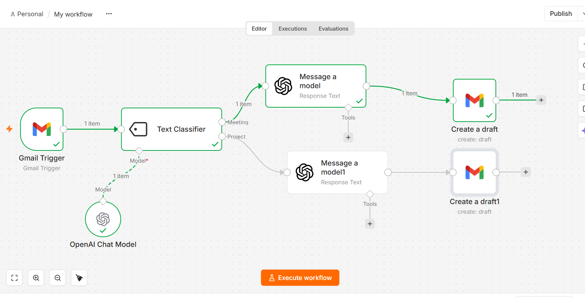

# Gmail Assistant - AI-Powered Email Reply Bot



An intelligent n8n workflow that automatically monitors your Gmail inbox, classifies incoming emails, and uses AI to draft professional, context-aware replies. It acts as a personal email assistant, saving you time and ensuring timely responses.

## 🚀 Features

*   **Gmail Monitoring:** Automatically triggers on new emails in your inbox.
*   **AI Email Classification:** Uses OpenAI (GPT-4o-mini) to intelligently categorize emails (e.g., "Meeting", "Project").
*   **AI-Powered Draft Replies:** Generates a complete email reply, including a subject and body, based on the original email's content.
*   **Automated Draft Creation:** Saves the AI-generated response directly as a draft in your Gmail account for your final review before sending.
*   **Easily Customizable:** You can easily change the classification categories and the AI prompt to suit your specific needs.

## 🛠️ How It Works

The workflow follows a simple yet powerful logic path:

1.  **Trigger:** The `Gmail Trigger` node polls your inbox for new emails.
2.  **Classify:** The `Text Classifier` node (powered by an OpenAI model) analyzes the email snippet and categorizes it.
3.  **Generate Reply:** Based on the category, the workflow uses an `OpenAI` node to act as a copywriter and generate a reply.
4.  **Create Draft:** The `Gmail` node creates a new draft in your inbox with the generated subject and body.

### Workflow Diagram

```mermaid
graph LR
    A[Gmail Trigger<br/>Monitors Inbox] --> B[Text Classifier<br/>Categorizes Email]
    B --> C[OpenAI<br/>Generate Reply]
    C --> D[Gmail<br/>Create Draft]